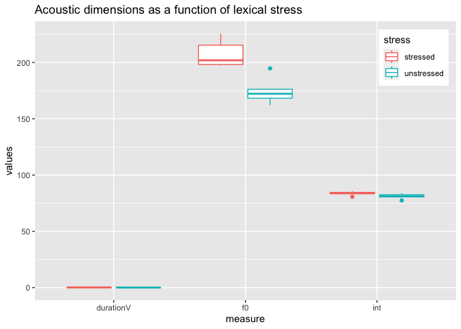
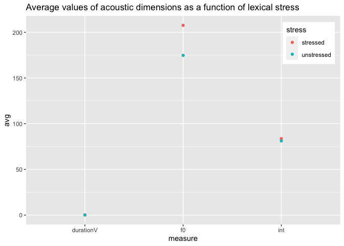

# Programming Assignment 2

## Load packages and data

``` r
library("tidyverse")
```

    ## ── Attaching packages ─────────────────────────────────────── tidyverse 1.3.2 ──
    ## ✔ ggplot2 3.4.0     ✔ purrr   1.0.1
    ## ✔ tibble  3.2.1     ✔ dplyr   1.1.0
    ## ✔ tidyr   1.3.0     ✔ stringr 1.5.0
    ## ✔ readr   2.1.3     ✔ forcats 1.0.0
    ## ── Conflicts ────────────────────────────────────────── tidyverse_conflicts() ──
    ## ✖ dplyr::filter() masks stats::filter()
    ## ✖ dplyr::lag()    masks stats::lag()

``` r
library("here")
```

    ## here() starts at /Users/meritxellfeliuribas/Desktop/pa_2

``` r
data <- read_csv(here("data", "data.csv"))
```

    ## Rows: 10 Columns: 4
    ## ── Column specification ────────────────────────────────────────────────────────
    ## Delimiter: ","
    ## chr (1): info
    ## dbl (3): durationV, f0, int
    ## 
    ## ℹ Use `spec()` to retrieve the full column specification for this data.
    ## ℹ Specify the column types or set `show_col_types = FALSE` to quiet this message.

``` r
summary(data)
```

    ##      info             durationV            f0             int       
    ##  Length:10          Min.   :0.0800   Min.   :162.2   Min.   :77.48  
    ##  Class :character   1st Qu.:0.0900   1st Qu.:173.2   1st Qu.:80.88  
    ##  Mode  :character   Median :0.1000   Median :196.0   Median :83.02  
    ##                     Mean   :0.1260   Mean   :191.2   Mean   :82.43  
    ##                     3rd Qu.:0.1725   3rd Qu.:201.0   3rd Qu.:83.98  
    ##                     Max.   :0.2000   Max.   :225.4   Max.   :85.68

``` r
glimpse(data)
```

    ## Rows: 10
    ## Columns: 4
    ## $ info      <chr> "capo_1", "capo_2", "pinto_1", "pinto_2", "pujo_1", "pujo_2"…
    ## $ durationV <dbl> 0.18, 0.09, 0.11, 0.08, 0.19, 0.09, 0.20, 0.09, 0.15, 0.08
    ## $ f0        <dbl> 198.26, 162.15, 215.37, 194.79, 225.44, 176.20, 201.95, 168.…
    ## $ int       <dbl> 83.45, 80.61, 80.78, 77.48, 84.55, 82.58, 83.98, 83.98, 85.6…

## Tidy data

``` r
data_final <- data %>%
  pivot_longer(
    cols = durationV:int,
    names_to = "measure",
    values_to = "values") %>%
  separate(
    col = info,
    into = c("word", "stress"),
    sep = "_")

# 1 = stressed vowel
# 2 = unstressed vowel
```

## Average duration, f0, and intensity as a function of lexical stress

### Calculations

``` r
data_final %>%
  group_by(stress, measure) %>%
  summarize(avg = mean(values)) %>%
  pivot_wider(names_from = "stress", values_from = "avg")
```

    ## `summarise()` has grouped output by 'stress'. You can override using the
    ## `.groups` argument.

    ## # A tibble: 3 × 3
    ##   measure       `1`     `2`
    ##   <chr>       <dbl>   <dbl>
    ## 1 durationV   0.166   0.086
    ## 2 f0        208.    175.   
    ## 3 int        83.7    81.2

### Plots

``` r
data_final %>%
  ggplot() +
  aes(x = measure, y = values, color = stress) +
  geom_boxplot() +
  scale_color_discrete(labels = c("stressed", "unstressed")) +
  labs(title = "Acoustic dimensions as a function of lexical stress") +
  theme(legend.position = c(0.90, 0.87)) 
```

<!-- -->

``` r
data_final %>%
  group_by(stress, measure) %>%
  summarise(avg = mean(values)) %>%
  ggplot(aes(x = measure, y = avg, color = factor(stress))) +
  geom_point() +
  scale_color_discrete(labels = c("stressed", "unstressed"), name = "stress") +
  labs(title = "Average values of acoustic dimensions as a function of lexical stress") +
  theme(legend.position = c(0.90, 0.87)) 
```

    ## `summarise()` has grouped output by 'stress'. You can override using the
    ## `.groups` argument.

<!-- -->
